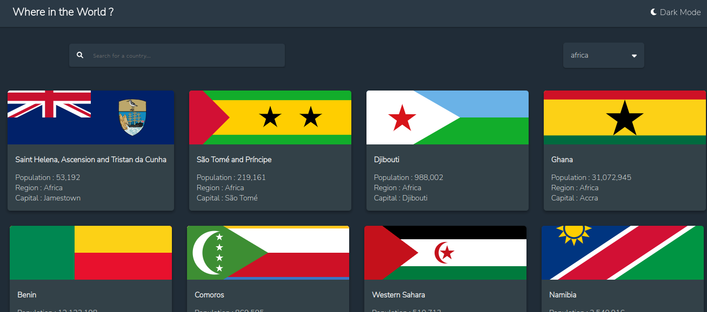

## Overview

Countries Applications provides an Aesthetic and user Friendly means of Navigation through our REST countries API . It displays countries based on continents selected and enables you to search for particular countries in that continent as well as displaying some certain characteristics/information about the country e.g flag , population etc .

### Screenshot

;

### Links

- Solution URL: [https://github.com/jerncomania28/countries-app](https://github.com/jerncomania28/countries-app)
- Live Site URL: [https://jerncomania28.github.io/countries-app/](https://jerncomania28.github.io/countries-app/)

## Features

- Filter by continents and by countries.
- Search feature.
- Dark and white mode feature.

### Built with

- Semantic HTML5 markup
- CSS custom properties
- Flexbox
- SCSS/Sass
- Mobile-first workflow
- [React](https://reactjs.org/) - JS library
